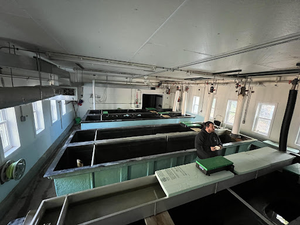
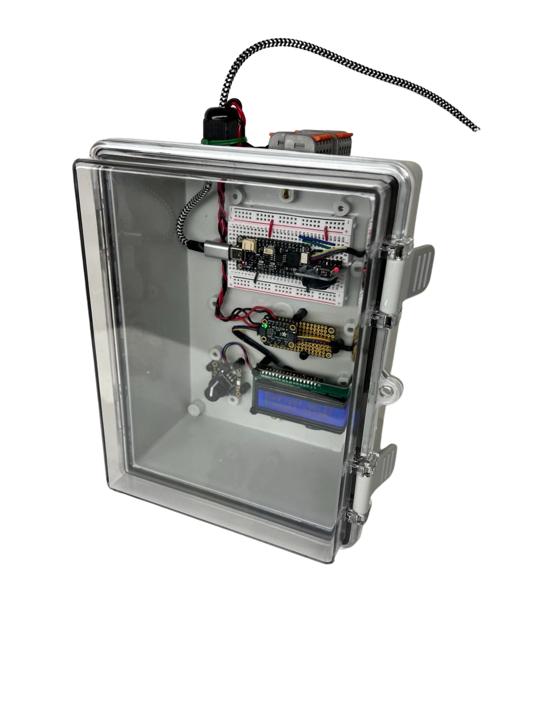

# Controlled Lighting for the Keweenaw Bay Tribal Fish Hatchery
Jonas Kazlauskas, Matthew Phillips  
Summer 2023 [TECHSCEnE REU Program](https://www.techscene.mtu.edu/home) research project  
Advised by Dr. Christopher Middlebrook  
Department of Electrical and Computer Engineering, Michigan Technological University, Houghton, Michigan, USA  

This work was funded by the NSF grant #2050739 awarded to Dr. Rao and Dr. Gagnon, Michigan Technological University and carried out under the guidance of the Natural Resources Department, Keweenaw Bay Indian Community

# Objective
To create a lighting system for the Keweenaw Bay Tribal Hatchery to prevent light shock on the fish, provide natural spawning signals, and help hatchery technicians. 

# Context

### Stamp Sands
A century ago the Mohawk and Wolverine copper mines dumped mine tailings containing toxic materials along the Lake Superior Shoreline. These mine tailings became known as “stamp sands” and they covered beaches, wildlife, and fish spawning habitat.

### Native Fish Habitat
Stamp sands have damaged the natural reef habitat for 
many native fish. Buffalo reef is a 2,200 acre natural cobble feature near the Keweenaw Peninsula that was affected by stamp sands. It is estimated that by 2025 60% of the reef will no longer support lake trout and whitefish spawning ([Michigan DNR](https://www.michigan.gov/dnr/managing-resources/fisheries/units/buffalo-reef)).

### Keweenaw Bay Tribal Fish Hatchery
The [Keweenaw Bay Tribal Hatchery](https://nrd.kbic-nsn.gov/fisheries) is focused on raising native fish to stock the lakes and streams in the Keweenaw. They aim to provide a self-sustaining fishery so that for every fish taken out of the lake one is put in. This work both rebuilds the ecosystem and supports commercial fishers in the Keweenaw.

  
*The Keweenaw Bay Tribal Hatchery Broodstock building*  

# Problem

### Hatchery Lighting

Light shock can occur in fish when immediate bright lights are turned on, such as flicking on a light switch. This can lead to high levels of stress and lower growth rates in the fish ([Head, Malison 2007](https://doi.org/10.1111/j.1749-7345.2000.tb00700.x)).

Photoperiod is used by many fish as a seasonal signal for when to spawn. Without this signal the spawning period can lengthen and spawning rates can drop.

  
*Inside the KBIC Hatchery Broodstock building*

The hatchery faces both problems of light shock and spawning difficulty. Pictured above is the inside of their broodstock building, where their overhead lights are never turned on to prevent fish shock. The side windows provide the only light in the building. 

# Our Goal
To create a lighting system for the Keweenaw Bay Tribal Hatchery that prevents light shock on the fish, provides natural spawning signals, and helps hatchery technicians. 
### Design Criteria
- Mimic daily sunrise and sunset cycles
- Change photoperiod throughout the season to provide natural spawning signals
- Automated to prevent additional workload on hatchery technicians
- Manual intervention for hatchery technicians to control and experiement with the lighting
- Operates over long periods of time
- Resumes after power outages

# Our Work
We built and installed an automated lighting system to mimic the sunrise and sunset inside the KBIC hatchery. This system calculates sunrise and sunset times based on the location of the hatchery and slowly adjusts light brightness accordingly. System settings can be changed through a rotary encoder, and information is displayed on an LCD screen. The following variables are adjustable:

- Sunrise and sunset length
- Manual mode (user-defined sunrise and sunset time)
- Maximum brightness

Settings are saved to the MCU’s memory, allowing the system to resume after power disruptions. The system is designed to support controlling 5+ lights at a time. Below are images of our lighting system

  

  

  

  

We installed this prototype in the KBIC hatchery connected to two lights. The placed our control system was in their electronics room and wired it to two led lights hanging in the facility. We hope this work will:

- Shorten the spawning season for the fish hatchery
- Improve the health of eggs and fish 
- Inspire other hatcheries to use automated lighting

Below is an image of our lighting system installed inside the KBIC fish hatchery.

  

  

To see our initial prototype navigate to the `v1` folder. Our second and final version can be found in our `v2` folder. Data and plots from testing can be found in the `notebooks` folder. Full documentation including our research and planning for this project can be found on our [notion page](https://aboard-smelt-100.notion.site/KBIC-Fish-Hatchery-Lighting-Project-0fc3fc064985408a982954ea42f111fe?pvs=4). 

