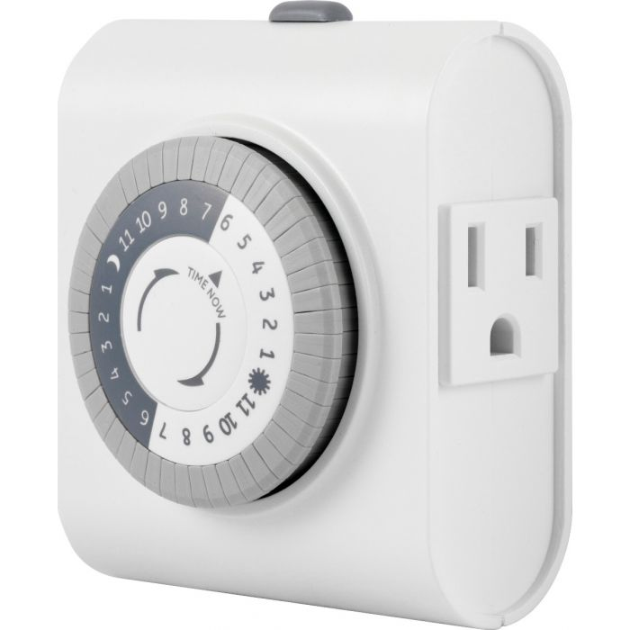
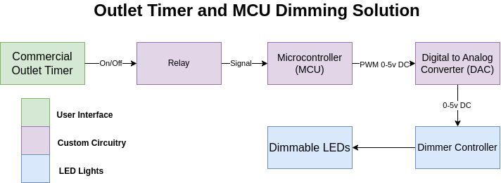

# Version 1

### Overview

Connect a commercial timer unit to dimming circuit that handles slowly turning
the lights on and off. This has the benefit of replaceable parts, intuitive
interface, and simple code. However, this solution does require a timer to be
changed periodically by workers, and may require code changes if some portions
fail.

  

This solution was chosen because it is simple to build, requires minimal
knowledge to interact with, and can be expanded in the future.

Below is a diagram showing the full solution from outlet timer to LEDs. This is
designed to work with any LED that supports standard 0-10v dimming, which is
common among commercial LEDs.

  

Parts used for this solution can be found
[here](https://docs.google.com/spreadsheets/d/1pHa5Yd9YNhHifhDOgKyAeoP4dDH_vc7fpJTdfh1lPWk/edit#gid=0)

Testing and performance can be found in the `notebooks` folder. This solution
was installed and run successfully in the hatchery for two weeks before being
replaced by our second version.

### Additional Details

For an in-depth look at this design and a usage guide see
[here](https://drive.google.com/file/d/1YI_DPENPqW6rQR0ZTeHM6hKCzs4sr6o4/view?usp=sharing).
