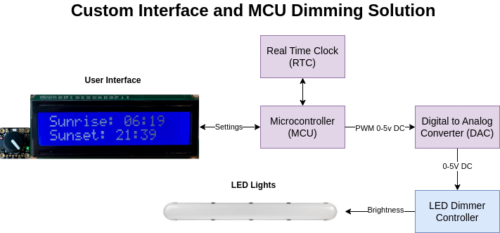

# Version 2

### Overview

The primary drawback of our outlet timer solution is the need to update the
timing throughout the season. To address this, the custom interface solution
calculates the sunrise and sunset time each day. This means the hatchery
workers do not need to adjust anything unless desired. To allow for control by
the hatchery workers, a rotary encoder/button and LCD is provided to change the following
parameters:

- Max light intensity
- Ramp time (time between first light and max intensity)
- Manual mode with start time and end time

Each page of the LCD screen is enumerated in the `View` class. Below is a system
diagram.

  

### Technical Details

- Our code is written using the open source
  [PlatformIO](https://platformio.org/?utm_source=platformio&utm_medium=piohome)
  platform, and Arduino framework.
- We used the Model-View-Controller framework to organize our code
- We used the Arduino LiquidCrystal Library to interact with the LCD:
  [tutorial](https://learn.adafruit.com/character-lcds/arduino-code)
- We used the [Adafruit SeeSaw](https://github.com/adafruit/Adafruit_Seesaw)
  library for the rotary encoders
- We used the [Sunset library](https://github.com/buelowp/sunset) to calculate the sunrise and sunset over time

Parts used for this solution can be found
[here](https://docs.google.com/spreadsheets/d/1pHa5Yd9YNhHifhDOgKyAeoP4dDH_vc7fpJTdfh1lPWk/edit#gid=0)

Testing and performance can be found in the `notebooks` folder. This solution
was installed and run inside the hatchery successfully.
